<div align="center">

# VisionTrack

### Real-Time Face Analytics Platform

A modular face recognition system built around vector similarity search, event-driven processing, and searchable identity analytics.

</div>

---

## Table of Contents

- Overview
- Why VisionTrack?
- Problem Statement
- Solution
- Core Capabilities
- Technology Stack
- System Architecture
- Recognition Pipeline
- Project Structure
- Getting Started
- Future Work

---

# Overview

VisionTrack is a modular face analytics platform for continuous identity recognition from live camera streams.

The system combines face detection, deep facial embeddings, vector similarity search, asynchronous event processing, and historical search into a unified recognition pipeline. Rather than treating face recognition as an isolated prediction task, VisionTrack models recognition as a continuous stream of events, allowing identities to be recognized, searched, and analyzed over time.

The platform follows a service-oriented architecture in which recognition, storage, search, and event processing operate as independent components. By combining YOLOv8 Face, InsightFace ArcFace, Apache Kafka, Milvus, FastAPI, and React, VisionTrack provides a scalable foundation for real-time identity management and analytics.

---

# Why VisionTrack?

Many face recognition projects demonstrate recognition on individual images or short video clips. While these implementations showcase the underlying machine learning model, they rarely address the engineering challenges involved in deploying a recognition system in a real-world environment.

VisionTrack extends beyond identity prediction by treating recognition as a continuously evolving data pipeline.

The project introduces asynchronous event streaming, vector similarity search, identity persistence, presence management, and searchable recognition history while maintaining a modular architecture in which each subsystem can evolve independently.

This approach separates computer vision from storage, search, and analytics, making the platform easier to scale, maintain, and extend.

---

# Problem Statement

Traditional surveillance systems primarily function as passive recording devices. Although they continuously capture video, they provide limited information about who appeared, when they appeared, or where they were previously observed.

Similarly, many face recognition projects focus solely on assigning an identity to a single image. Such approaches do not address the requirements of production systems where recognition must operate continuously across live camera feeds while maintaining searchable history and minimizing duplicate detections.

A practical recognition platform should be capable of:

- Processing live camera streams continuously.
- Persistently managing recognized identities.
- Eliminating redundant recognitions across consecutive frames.
- Maintaining searchable recognition history.
- Supporting multiple cameras and deployment locations.
- Performing low-latency similarity search.
- Decoupling recognition from storage and downstream processing.

VisionTrack addresses these challenges through an event-driven architecture centered around vector similarity search and asynchronous processing.

---

# Solution

VisionTrack transforms a live camera stream into a searchable stream of recognition events.

Each detected face is validated before a facial embedding is generated using ArcFace. The embedding is compared against previously enrolled identities stored in Milvus using cosine similarity. Depending on configurable recognition thresholds, the system either associates the face with an existing identity or creates a new identity.

Rather than directly writing recognition results to storage, VisionTrack publishes recognition events through Apache Kafka. Downstream consumers independently process these events, maintain identity records, and persist historical recognition data without blocking the live recognition pipeline.

A lightweight in-memory presence cache further reduces unnecessary database searches by identifying recently observed individuals and suppressing duplicate recognition events across consecutive frames.

The platform exposes search and analytics services through FastAPI, allowing users to retrieve recognition history, search identities using one or multiple images, monitor live recognition events, and integrate the platform with external applications.

---

# Core Capabilities

| Capability | Description |
|------------|-------------|
| Real-Time Face Detection | Detects faces from live camera streams using a YOLOv8 Face detector. |
| Face Quality Validation | Rejects low-quality detections based on confidence, face size, blur, and pose before recognition. |
| Deep Face Recognition | Generates normalized 512-dimensional facial embeddings using InsightFace ArcFace. |
| Vector Similarity Search | Performs low-latency identity search using Milvus and cosine similarity. |
| Presence Management | Prevents redundant recognition events using an in-memory presence cache. |
| Event Streaming | Publishes recognition events asynchronously through Apache Kafka. |
| Recognition History | Maintains searchable historical recognition events together with associated metadata. |
| Image Search | Supports both single-image and multi-image identity search. |
| REST API | Provides endpoints for search, statistics, event history, and live updates. |
| Modular Architecture | Separates detection, recognition, storage, messaging, and search into independent services. |

# Technology Stack

| Layer | Technology |
|--------|------------|
| Programming Language | Python 3.11 |
| Face Detection | YOLOv8 Face |
| Face Recognition | InsightFace (ArcFace) |
| Vector Database | Milvus |
| Event Streaming | Apache Kafka |
| Backend API | FastAPI |
| Dashboard | React |
| Image Processing | OpenCV |
| Deep Learning Runtime | ONNX Runtime |
| Similarity Metric | Cosine Similarity |

---

# System Architecture

```mermaid
flowchart LR

%% Capture
subgraph Capture
A["Camera Stream"]
B["Frame Capture"]
end

%% Detection
subgraph Detection
C["YOLOv8 Face Detector"]
D["Face Cropping"]
E["Face Validation"]
F["Recognition Worker"]
end

%% Event Generation
subgraph EventGeneration
G["Image Upload"]
H["Kafka Producer"]
I["face-events"]
end

%% Recognition
subgraph Recognition
J["Kafka Consumer"]
K["ArcFace Embedding Generator"]
L["Presence Cache"]
M["Milvus Identity Search"]
end

%% Decision
subgraph Decision
N["Existing Identity"]
O["New Identity"]
end

%% Persistence
subgraph Persistence
P["Persons Collection"]
Q["Detection Event Producer"]
R["detection-events"]
S["Detection History Consumer"]
T["Recognition History"]
end

%% Search
subgraph Search
U["Search Service"]
V["FastAPI"]
W["REST API"]
X["SSE Stream"]
end

%% Frontend
subgraph Dashboard
Y["React Dashboard"]
end

A --> B
B --> C
C --> D
D --> E
E --> F

F --> G
G --> H
H --> I

I --> J
J --> K

K --> L

L -->|Cache Hit| N
L -->|Cache Miss| M

M -->|Existing Match| N
M -->|No Match| O

O --> P

N --> Q
O --> Q

Q --> R
R --> S
S --> T

P --> U
T --> U

U --> V

V --> W
V --> X

W --> Y
X --> Y
```



VisionTrack follows an event-driven service architecture in which recognition, identity management, event persistence, and search are implemented as independent components.

Rather than directly coupling recognition with storage, the live recognition pipeline publishes events to Apache Kafka. Downstream consumers process these events asynchronously, ensuring that database operations and historical persistence never block the camera pipeline.

Identity information and recognition history are maintained separately within Milvus. The **Persons Collection** stores one embedding for every unique identity, while the **Recognition History** collection stores every confirmed recognition event together with its associated metadata. This separation enables efficient similarity search while preserving a complete timeline of observations.

---

# Recognition Pipeline

VisionTrack transforms a live camera stream into searchable identity records through a sequence of processing stages.

## 1. Face Detection

Frames captured from a live camera are processed using a YOLOv8 Face detector. Every detected face is localized, cropped, and forwarded for quality validation.

Only valid face regions continue through the recognition pipeline, reducing unnecessary computation.

---

## 2. Face Validation

Each detected face undergoes a series of quality checks before recognition begins.

Validation includes:

- Detection confidence
- Face size
- Blur estimation
- Face orientation
- Empty or invalid crops

Faces failing these checks are discarded before embedding generation.

---

## 3. Event Generation

Validated faces are uploaded and converted into recognition events.

Each event contains:

- Camera ID
- Store ID
- Image ID
- Timestamp

These events are published to the `face-events` Kafka topic, allowing recognition to occur asynchronously.

---

## 4. Embedding Generation

A Kafka consumer retrieves incoming recognition events and generates a normalized 512-dimensional facial embedding using InsightFace ArcFace.

The embedding serves as the numerical representation of facial identity and is used for all subsequent similarity comparisons.

---

## 5. Presence Management

Before querying the vector database, VisionTrack checks an in-memory Presence Cache.

Recently observed individuals are matched directly using cosine similarity, allowing the system to avoid repeated database searches and duplicate recognition events across consecutive frames.

---

## 6. Identity Resolution

If no cache match exists, the embedding is searched against Milvus using cosine similarity.

Based on configurable similarity thresholds, one of three outcomes is produced.

| Result | Action |
|--------|--------|
| Existing identity | Recognition event created |
| New identity | New person inserted into Milvus |
| Borderline similarity | Recognition deferred |

---

## 7. Event Persistence

Confirmed recognitions are published to the `detection-events` Kafka topic.

A dedicated consumer stores every confirmed recognition inside the Recognition History collection together with:

- Person Identifier
- Camera Identifier
- Store Identifier
- Timestamp
- Image Reference
- Facial Embedding

Maintaining historical events separately from identity embeddings enables efficient similarity search while preserving complete observation history.

---

## 8. Search and Analytics

FastAPI exposes services for:

- Identity search
- Multi-image search
- Recognition history
- Live event streaming
- Recognition statistics

These endpoints are consumed by the React dashboard, providing real-time visualization of recognition events and searchable identity history.

---

# Design Principles

| Principle | Description |
|-----------|-------------|
| Modular Services | Each subsystem performs a single responsibility. |
| Event-Driven Communication | Recognition and persistence communicate asynchronously through Kafka. |
| Vector-Based Recognition | Identity matching is performed using embedding similarity rather than image comparison. |
| Low Latency | Presence caching minimizes repeated database queries. |
| Scalable Architecture | Services can be extended or replaced independently. |
| Searchable History | Every confirmed recognition is stored for future retrieval and analysis. |

# Project Structure

```
VisionTrack/
│
├── api/
│   ├── api.py                  # FastAPI application
│   └── config.py               # API configuration
│
├── models/
│   ├── detection_event.py
│   ├── face_event.py
│   └── ...
│
├── services/
│   ├── camera_service.py
│   ├── face_detection_service.py
│   ├── face_recognition_service.py
│   ├── kafka_producer_service.py
│   ├── kafka_consumer_service.py
│   ├── detection_event_producer.py
│   ├── detection_history_consumer.py
│   ├── milvus_service.py
│   ├── presence_cache_service.py
│   ├── recognition_worker.py
│   ├── search_service.py
│   └── ...
│
├── saved_faces/                # Captured face images
├── invalid_faces/              # Rejected face samples
├── logs/                       # Performance logs
│
├── docker-compose.yml
├── Dockerfile
├── main.py                     # Recognition pipeline entry point
└── README.md
```

---

## Module Overview

| Module | Responsibility |
|---------|----------------|
| **api/** | Exposes REST APIs and Server-Sent Events for search, analytics, and live recognition updates. |
| **models/** | Defines shared data models exchanged between services. |
| **services/** | Contains the core business logic, including detection, recognition, vector search, Kafka messaging, caching, and event persistence. |
| **saved_faces/** | Stores captured face images associated with recognition events. |
| **invalid_faces/** | Stores rejected face samples together with validation metadata for debugging and analysis. |
| **logs/** | Records pipeline timing information for latency and performance analysis. |

---

# Getting Started

## Prerequisites

Before running VisionTrack, ensure the following dependencies are available.

| Requirement | Version |
|-------------|---------|
| Python | 3.11+ |
| Docker | Latest |
| Docker Compose | Latest |
| Node.js | 20+ (Dashboard) |
| Git | Latest |

---

## Clone the Repository

```bash
git clone https://github.com/<your-username>/VisionTrack.git

cd VisionTrack
```

---

## Install Python Dependencies

```bash
pip install -r requirements.txt
```

---

## Start Infrastructure Services

VisionTrack relies on Apache Kafka and Milvus for event streaming and vector similarity search.

```bash
docker compose up -d
```

This starts:

- Apache Kafka
- Zookeeper
- Milvus
- etcd
- MinIO

Wait until all services are healthy before continuing.

---

## Start the Search API

```bash
cd api

uvicorn api:app --reload
```

---

## Start the Detection History Consumer

```bash
python run_consumer.py
```

---

## Start the Recognition Pipeline

```bash
python main.py
```

The application will begin capturing frames from the configured camera and processing recognition events in real time.

---

# Configuration

Runtime behaviour can be configured through the project configuration files.

| Parameter | Description |
|-----------|-------------|
| Camera ID | Unique identifier for each camera stream |
| Store ID | Logical deployment location |
| Recognition Threshold | Minimum similarity required to classify an existing identity |
| Presence Timeout | Time before a person is considered absent |
| Search Threshold | Minimum similarity accepted during search |

---

# Performance

VisionTrack records performance metrics for each processed recognition event.

The following stages are measured independently:

- Kafka delivery delay
- Embedding generation time
- Presence cache lookup
- Milvus search latency
- Person insertion time
- Kafka publish time
- End-to-end pipeline latency

Performance logs are written to:

```
logs/performance.csv
```

These measurements help identify pipeline bottlenecks and evaluate recognition performance under varying workloads.

---

# Future Work

Several improvements are planned for future iterations of VisionTrack.

- Multi-camera identity association
- Distributed deployment across multiple recognition nodes
- GPU acceleration for embedding generation
- Face enrollment interface
- Person re-identification across disconnected cameras
- Automatic face quality scoring
- Temporal identity tracking
- Role-based authentication
- Recognition analytics dashboard
- Edge deployment using lightweight inference models

---

# Acknowledgements

VisionTrack builds upon several open-source technologies.

- Ultralytics YOLO
- InsightFace
- Apache Kafka
- Milvus
- FastAPI
- React
- OpenCV

Their excellent work made this project possible.
