# VisionTrack

### Real-Time Face Analytics Platform

A modular face recognition system built around vector similarity search, event-driven processing, and real-time identity analytics.

---

## Table of Contents

- Overview
- Problem Statement
- Solution
- Core Capabilities
- Technology Stack
- System Architecture
- Recognition Pipeline
- Project Structure
- Getting Started
- Future Work

---

# Overview

VisionTrack is a real-time face analytics platform designed for continuous identity recognition from live camera streams.

The system combines face detection, deep facial embeddings, vector similarity search, event streaming, and searchable recognition history into a single modular pipeline. Unlike traditional face recognition applications that operate on isolated images, VisionTrack models recognition as a continuous stream of events, allowing identities to be searched, tracked, and analyzed over time.

Built around a service-oriented architecture, the platform integrates YOLOv8 Face for detection, InsightFace ArcFace for facial embeddings, Milvus for vector similarity search, Apache Kafka for asynchronous event streaming, FastAPI for backend services, and React for visualization. Each subsystem is designed to operate independently, making the platform scalable, maintainable, and easy to extend.

---

# Problem Statement

Conventional surveillance systems are largely passive. Although they continuously record video, they provide limited insight into who appears, when they appeared, or where they were previously observed.

Most face recognition projects focus on recognizing a single image and returning a predicted identity. Such approaches are insufficient for real-world deployments where recognition must operate continuously across live camera feeds while maintaining searchable identity history and minimizing duplicate detections.

A practical face recognition platform should be capable of:

- Continuously processing live video streams.
- Persistently managing recognized identities.
- Reducing redundant recognition caused by consecutive frames.
- Maintaining searchable detection history.
- Supporting multiple cameras and deployment locations.
- Performing low-latency similarity search.
- Decoupling recognition from storage and downstream processing.

VisionTrack addresses these challenges through a modular, event-driven architecture centered around vector similarity search.

---

# Solution

VisionTrack transforms a live camera feed into a searchable stream of recognition events.

Each detected face is first validated to reject low-quality samples before generating a deep facial embedding using ArcFace. The embedding is then compared against previously enrolled identities stored within Milvus using cosine similarity. Based on configurable recognition thresholds, the system either associates the face with an existing identity or creates a new person record.

Recognition events are published asynchronously through Apache Kafka, allowing downstream services to process and persist event history independently of the recognition pipeline. A lightweight in-memory presence cache further reduces unnecessary database lookups by identifying recently observed individuals and suppressing duplicate recognition events across consecutive frames.

The platform exposes search and analytics services through FastAPI, enabling users to retrieve recognition history, search for individuals using one or more images, and monitor recognition events through a web dashboard.

---

# Core Capabilities

- **Real-Time Face Detection**  
  Detects faces from live camera feeds using a YOLOv8 Face detector optimized for fast inference and accurate localization.

- **Deep Face Recognition**  
  Generates normalized 512-dimensional facial embeddings using InsightFace ArcFace for robust identity matching across varying poses and lighting conditions.

- **Vector Similarity Search**  
  Stores facial embeddings in Milvus and performs approximate nearest-neighbor search using cosine similarity for low-latency recognition.

- **Event-Driven Architecture**  
  Streams recognition events through Apache Kafka, allowing recognition, storage, and search services to remain loosely coupled.

- **Presence Management**  
  Maintains an in-memory presence cache to prevent redundant recognition events and reduce unnecessary database operations.

- **Recognition History**  
  Persists every confirmed recognition event with associated metadata, including timestamp, camera identifier, image reference, and person identifier.

- **Image-Based Search**  
  Supports both single-image and multi-image search. Uploaded images are clustered before querying the vector database, improving search robustness when multiple images belong to the same individual.

- **REST API**  
  Exposes endpoints for identity search, event history, statistics, and live event streaming through FastAPI.

- **Modular Design**  
  Separates detection, recognition, storage, messaging, and search into independent services, simplifying maintenance and future extensions.

  # Technology Stack

| Layer | Technology |
|--------|------------|
| Language | Python 3.11 |
| Face Detection | YOLOv8 Face |
| Face Recognition | InsightFace (ArcFace) |
| Vector Database | Milvus |
| Event Streaming | Apache Kafka |
| Backend API | FastAPI |
| Dashboard | React |
| Image Processing | OpenCV |
| Deep Learning Runtime | ONNX Runtime |
| Similarity Metric | Cosine Similarity |

# System Architecture

```mermaid
flowchart LR

%% -------------------------
%% Capture Layer
%% -------------------------

subgraph Capture["Capture Layer"]
A["Camera Stream"]
B["Frame Capture"]
end

%% -------------------------
%% Detection Layer
%% -------------------------

subgraph Detection["Detection Layer"]
C["YOLOv8 Face Detector"]
D["Face Cropping"]
E["Face Validation"]
end

%% -------------------------
%% Recognition Layer
%% -------------------------

subgraph Recognition["Recognition Layer"]
F["Recognition Worker"]
G["ArcFace Embedding Generator"]
H["Presence Cache"]
I["Milvus Identity Search"]
end

%% -------------------------
%% Decision Layer
%% -------------------------

subgraph Decision["Identity Resolution"]
J["Existing Person"]
K["New Person"]
end

%% -------------------------
%% Event Layer
%% -------------------------

subgraph Events["Event Processing"]
L["Kafka Producer"]
M["Kafka Topic"]
N["Recognition Consumer"]
O["Detection Event Producer"]
P["Detection Topic"]
Q["History Consumer"]
end

%% -------------------------
%% Storage Layer
%% -------------------------

subgraph Storage["Persistence"]
R["Persons Collection"]
S["Recognition History"]
end

%% -------------------------
%% Service Layer
%% -------------------------

subgraph Services["Application Services"]
T["FastAPI Search API"]
U["REST Endpoints"]
V["SSE Event Stream"]
end

%% -------------------------
%% Presentation Layer
%% -------------------------

subgraph Dashboard["Dashboard"]
W["React UI"]
end

A --> B
B --> C
C --> D
D --> E

E --> F

F --> G

G --> H

H -->|Cache Miss| I
H -->|Cache Hit| J

I -->|Match| J
I -->|No Match| K

J --> L
K --> L

L --> M

M --> N

N -->|Insert Identity| R

N --> O

O --> P

P --> Q

Q --> S

R --> T
S --> T

T --> U
T --> V

U --> W
V --> W
```

VisionTrack follows an event-driven service architecture where face recognition, identity management, event persistence, and search operate as independent modules.

Rather than coupling recognition directly with storage, recognition events are published through Apache Kafka and processed asynchronously by downstream services. This separation reduces latency in the live recognition pipeline while allowing identity management, historical event storage, and search services to scale independently.

Two logical data stores are maintained within Milvus:

- **Persons Collection** stores a single embedding representing each unique identity.

- **Recognition History** stores every confirmed recognition event together with its associated metadata, enabling historical search and timeline reconstruction.

A lightweight Presence Cache minimizes redundant recognition by suppressing repeated detections of recently observed individuals before database lookup.

flowchart LR

Camera
--> Detect

Detect
--> Validate

Validate
--> Embed

Embed
--> Search

Search
--> Existing

Search
--> New

Existing
--> Event

New
--> Event

Event
--> Store

Store
--> API

API
--> Dashboard
